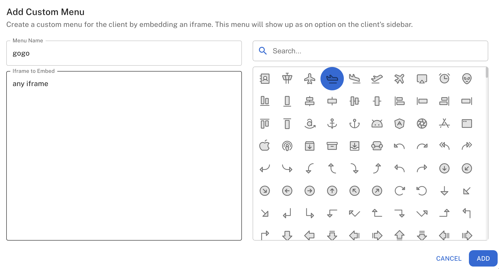
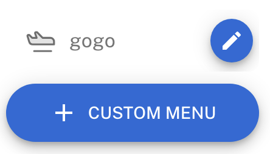

## Overview

Custom menus in ChatDash are a way to create a custom interface for your clients to view specific content or data.
You can embed any web content as iframe (e.g., Google Sheets, Airtable, Tableau, etc.) into the custom menu and share it with your clients.

## Adding a Custom Menu

1. Login as an agency user in ChatDash.
2. Go to the Clients tab in the ChatDash dashboard.
3. Find the client you want to add a custom menu for and click `Preview` button.
4. You will be redirected to the client dashboard.
5. Select on the project you want to add a custom menu for.
6. Click on the `+` icon on the bottom of the navigation bar.
7. Give a name, iframe to embed, and the icon for the custom menu.

    

8. Click on the `ADD` button to add the custom menu.
9. You will see the custom menu added with the logo on the navigation bar.

    
