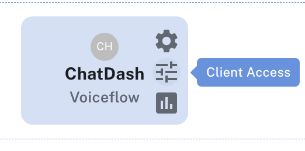
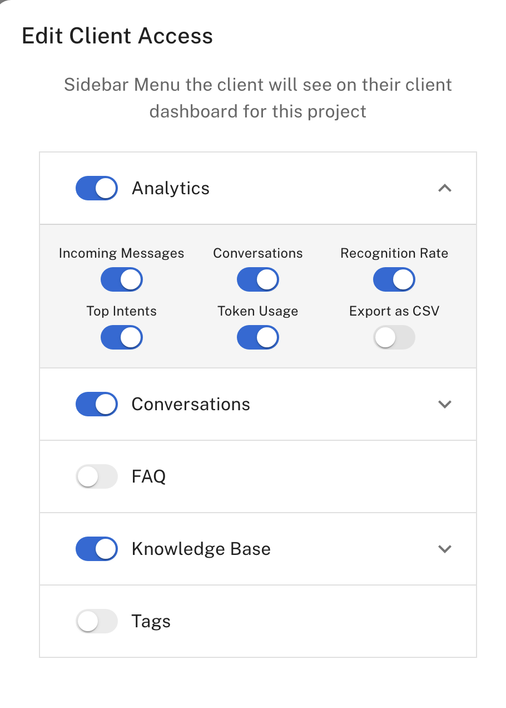

## Overview

As an agency user in ChatDash, you can manage client dashboard access for your clients. 
This allows you to take over full control on what your clients can see and do within their client dashboard.
You can manage client access by turning on/off specific features and settings for each project assigned to a client.
(This means that you can give different access levels to each project assigned to a client if they have multiple projects!)

## Managing Client Access

1. Login as an agency user in ChatDash.
2. Go to the Clients tab in the ChatDash dashboard.
3. Find the client's project you want to manage access for.
4. Click on `Client Access` button on the right side of the project.

    
5. You will see the modal with the following options:

    
    - **Shared Client Menus**:
        - **Analytics**: Allow the client to view analytics data.
        - **Conversations**: Allow the client to view conversation data.
    - **Platform Speciific Menus**:
        - **Voiceflow**: FAQ, Tags, Knowledge Base.
        - **OpenAI**: Chat Interface, Knowledge Base, Edit Assistant.
6. Toggle the switches to turn on/off the features and settings you want to give access to the client.

## FAQs

### Can I give different access levels to each project assigned to a client?

Yes, you can give different access levels to each project assigned to a client.

### Can I revoke access to a client dashboard?

Yes, you can revoke access to a client dashboard at any time.

### Can I give access to a client for a specific feature only?

Yes, you can give access to a client for a specific feature only by turning on the switch for that feature.
    