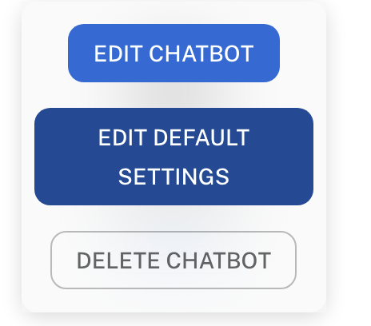
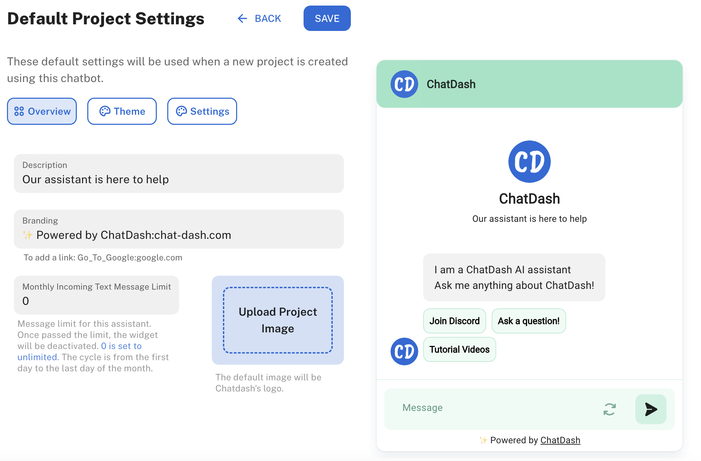

## Overview

As an agency user in ChatDash, you can edit the default settings of a chatbot.
This allows you to customize the chatbot's appearance (e.g., color, logo, name) and behavior (e.g., launch message) 
for all projects that will be created in the future by this chatbot.

## Editing Chatbot Default Settings

1. Login as an agency user in ChatDash.
2. Go to the `Chatbots` tab in the ChatDash dashboard.
3. Find and hover over the chatbot you want to edit the default settings for.
4. Click on the `Edit Default Settings` button.

    

5. You will be redirected to the Chatbot Default Settings page.
6. This page will be the exactly same page as the [Customizing a Webchat Project Setting](/docs/quickstart/customizing-a-webchat-project-setting) page.
7. Customize the settings as needed.
8. This will update the default settings for all future projects created by this chatbot.

    

## FAQs

### Can I edit the default settings of a chatbot for all projects?

Yes, you can edit the default settings of a chatbot for all projects that will be created in the future by this chatbot.

### Will the changes affect existing projects?

No, the changes will only affect the default settings for all future projects created by this chatbot. Existing projects will not be affected.

### Can I revert the changes to the default settings?

Yes, you can revert the changes to the default settings at any time by editing the default settings again.