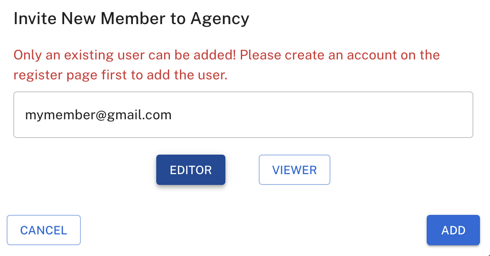

## Overview

As an agency user in ChatDash, you can invite members to your agency workspace.
This allows you to collaborate with your team members and work together on projects.
**The member you invite must have a ChatDash account to join your agency workspace.**

The member can have two different roles in the agency workspace:
1. **Editor**: Can create, edit, and delete projects.
2. **Viewer**: Can only view projects and analytics data.

## Inviting Members

1. Login as an agency user in ChatDash.
2. Go to Agency Settings -> Agency Profile in the ChatDash dashboard.
3. Scroll down to the `Agency Members` section.
4. Click on the `INVITE NEW MEMBERS` button.
5. Enter the member's email address and select which role you want to assign to the member.
    
6. Click on the `ADD` button to send the invitation.
7. The member will receive an email invitation to join your agency workspace.

