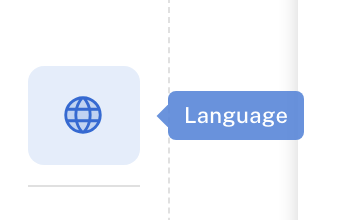

## Overview

Language settings in ChatDash allow you to set the desired language for your agency and client dashboard.
Adjust translations to your liking. 
These custom translations will apply for you and all clients of agencies in which you are the admin.

## Setting Language

1. Login as an agency user in ChatDash.
2. Click on the `Language` icon in the bottom left corner of the ChatDash dashboard.

    

3. You will see the following options:
    - **Agency Dashboard Language**: Choose the desired language for your agency dashboard.
    - **Target Language**: Choose the desired language for custom translations.
    - **Custom Translations**: Once you select the target language, you will see the default translations. You can edit these translations to your liking.

    

## Supported Languages

ChatDash supports the following default languages for custom translations:

- English
- Korean
- Croatian
- Swedish
- Arabic
- Bulgarian
- Czech
- Danish
- German
- Greek
- Spanish
- Finnish
- Filipino
- French
- Indonesian
- Italian
- Japanese
- Dutch
- Polish
- Portuguese
- Romanian
- Russian
- Slovak
- Thai
- Turkish
- Vietnamese

## FAQs

### Can I set different languages for my agency and client dashboard?

Yes, you can set different languages for your agency and client dashboard. You can set the desired language for your agency dashboard by changing the `Agency Dashboard Language` dropdown.
You can set the desired language for clients when you create a new client or edit an existing client.

### Can I set custom translations for my agency and client dashboard?

Yes, you can set custom translations for your agency and client dashboard.

### What if I don't see the desired language in the supported languages list?

If you don't see the desired language in the supported languages list, please contact the ChatDash support team for assistance.

### Can I revert the changes to the default translations?

Yes, you can revert the changes to the default translations at any time by editing the custom translations again.
