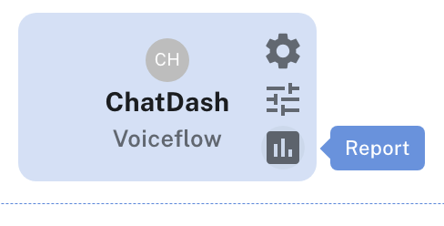
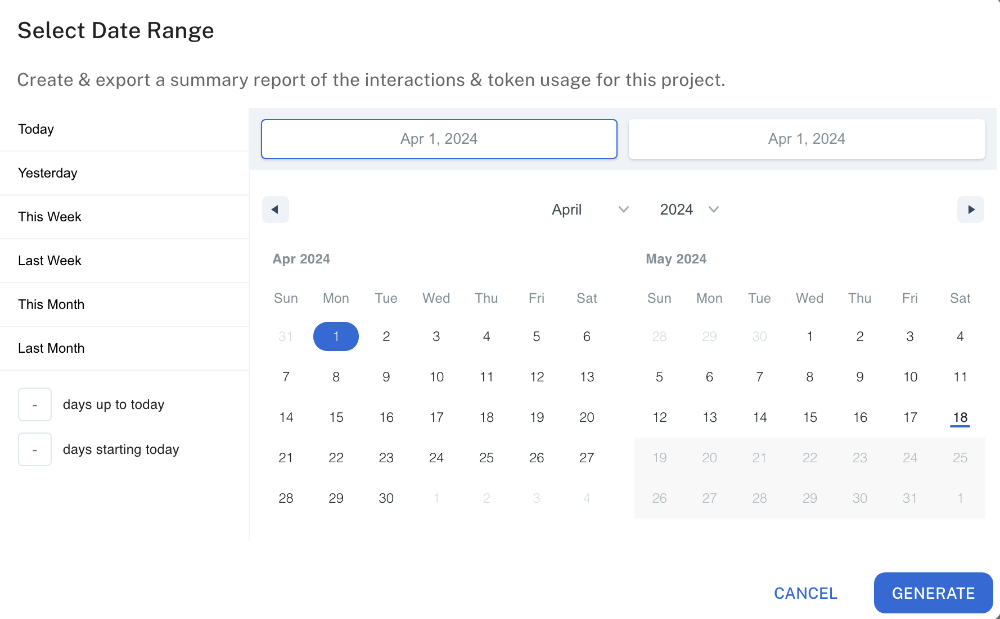

## Overview

Project usage reports in ChatDash are a way to generate detailed reports on how your clients are using the chatbot projects.
This allows you to track the usage of the chatbot projects and generate billing reports based off of the usage data such as the number or messages and token usage.

## Generating Project Usage Report

1. Login as an agency user in ChatDash.
2. Go to the Clients tab in the ChatDash dashboard.
3. Find the client's project you want to generate a usage report for.
4. Click on the `Project Usage Report` button on the right side of the project.

    

5. You will see the modal with the Date Range options.

    

6. Select the Date Range for which you want to generate the usage report.
7. Click on the `GENERATE` button to generate the usage report.
8. You will see the usage report with the following data:
    - **Total Incoming Messages**: Total number of incoming messages within the selected date range.
    - **Incoming Messages Per Day**: Number of incoming messages per day within the selected date range.
    - **Total Token Usage**: Total number of tokens used by ai models within the selected date range.
9. Click on the `EXPORT AS PDF` button to download the usage report in PDF format.