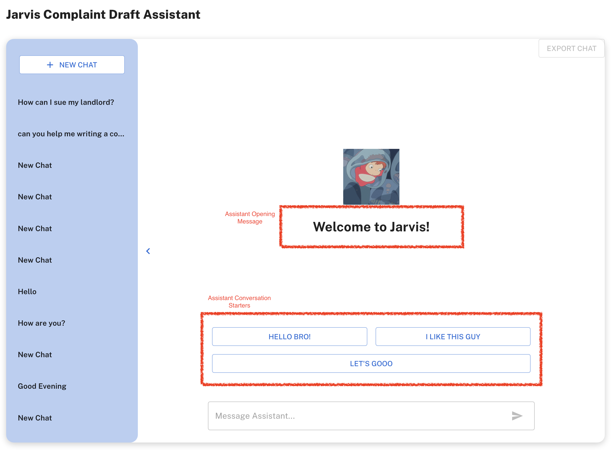

## Overview

The Chat Interface menu in the client dashboard allows clients to interact with the OpenAI Assistant and view the chat history.

    

You can change `Assistant Opening Message` and `Assistant Conversation Starters` in the [Edit Assistant](/client-dashboard/openai-menus/edit-assistant) menu.

## Chat Interface

The Chat Interface menu provides the following features:

- Chat with the OpenAI Assistant: Interact with the OpenAI Assistant in real-time.
- View Chat History: View the chat history with the OpenAI Assistant.
- Export Chat: Export the chat history with the OpenAI Assistant in CSV format.

