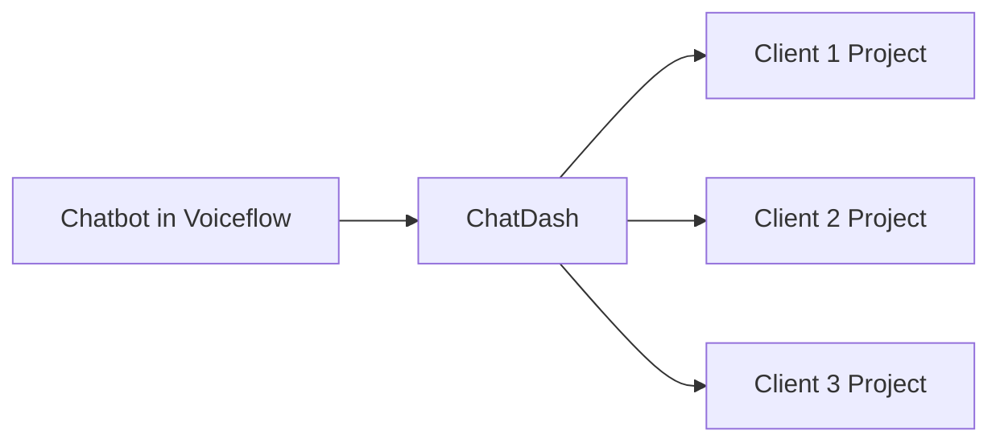

## Overview

Here are some frequently asked questions about ChatDash:

## FAQs

### What is ChatDash?

ChatDash is a chatbot management platform that allows agencies to create, deploy, and manage chatbots for their clients. 
It provides a seamless experience for agencies to manage multiple clients and projects in one place.

### Can I use Chatbot Builder's chat widget with ChatDash?

No, you need to use ChatDash's chat widget to interact with the chatbot.
Otherwise, the chat history and analytics will not be recorded in ChatDash.

### What is the difference between a chatbot and a project in ChatDash?

- **Chatbot**: A chatbot itself (or a chatbot engine) created in any supported platform (e.g., Voiceflow, OpenAI, Botpress).
- **Project**: A chatbot assigned to a client in ChatDash. (Chatbot becomes a project when it is assigned to a client)

For example, let's say you have a chatbot created in Voiceflow and you want 
to use this chatbot for many clients. 
In ChatDash, you can add this chatbot and make multiple projects for each client.
Of course, all the message history, analytics, and settings will be separate for each project.

### Transcripts/Analytics are not showing up in the dashboard. What should I do?

Please check the following:

1. Make sure you use the correct API key and secret for the platform you are using.
2. Make sure you use ChatDash's chat widget to interact with the chatbot.
3. Make sure you have enabled the `Record Conversation` option in the project settings.

If you are still facing issues, please contact our support team.