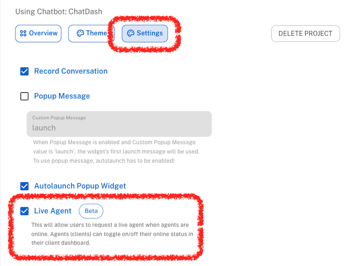

## Overview

Live human hands-off allows end-users to interact with the human agent (client) in real-time. The human agent can take over the conversation at any time during the chatbot conversation.

## Why Live Human Hands-off?

AI chatbots are great, but they can't answer every question. Sometimes, the chatbot may not understand the user's query or provide the wrong answer. 
In such cases, it's essential to have a live human agent take over the conversation to provide the correct information or resolve the user's query.
ChatDash allows you to enable live human hands-off for your clients, so they can take over the conversation at any time during the chatbot conversation with a single click.

## Turning on Live Human Hands-off

To turn on live human hands-off, follow these steps:

1. Go to the Project Settings page of the project you want to enable live human hands-off for.
2. Click on the Settings tab.
3. Toggle the Live Human Hands-off switch to ON.
4. Click on the Save button.

Now, your client can take over the conversation at any time during the chatbot conversation in client dashboard.

