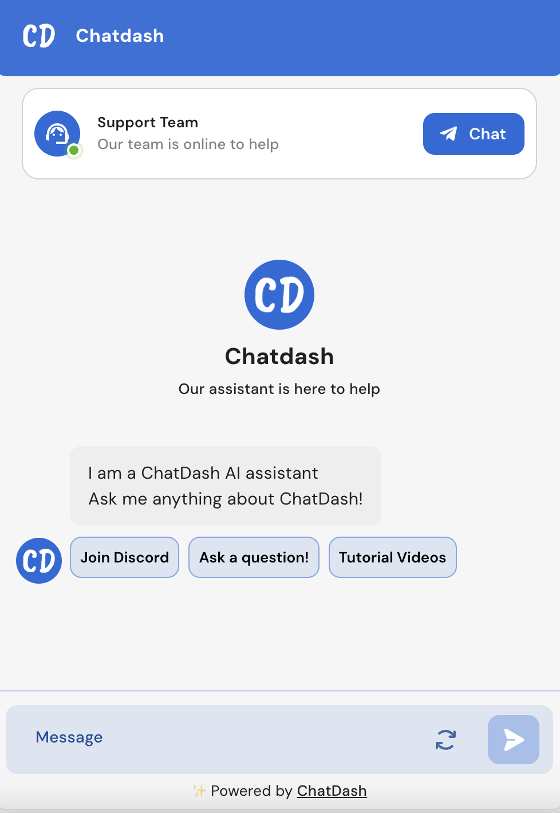
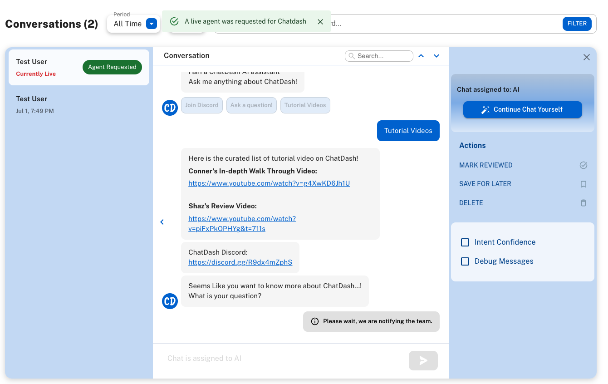
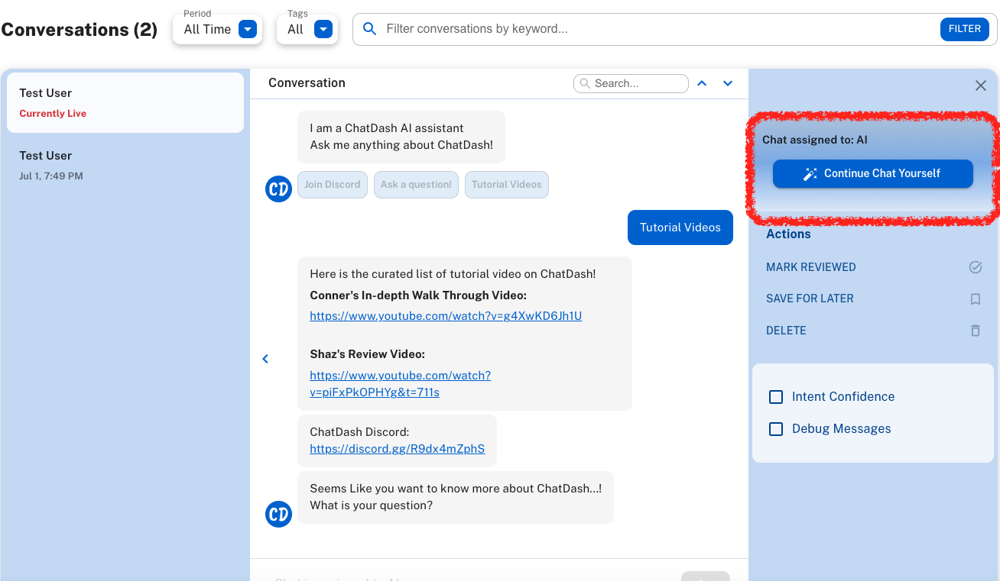

## Using Live Human Hands-off

When the live human hands-off feature is enabled, the client can take over the conversation by clicking on the "Continue Chat Yourself" button in the chatbot conversation.
If the client status is set to "Online", the end user's chat widget will show the "Chat" button on the top, allowing the end user to request a live human agent.

There are two ways to start a conversation with a human agent:

**1. The end-user requests a live human agent by clicking on the "Chat" button on the top of the widget.**

The client (human agent) will receive a notification that the end-user has requested a live human agent just like below:

The client (human agent) can then take over the conversation by clicking on the "Continue Chat Yourself" button in the chatbot conversation.

**2. The client (human agent) intercepts the conversation by clicking on the "Continue Chat Yourself" button in the chatbot conversation.**

