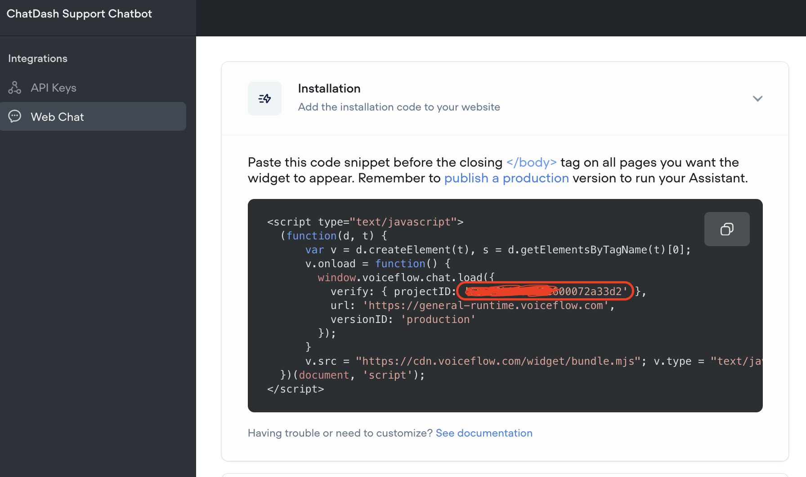

## Basic
Chatbot serves as a `conversational engine` connected to ChatDash.

This will be later used to create a `project` for your client.

As of now, ChatDash supports the following chatbot integrations:

1. [Voiceflow](https://www.voiceflow.com/)

<iframe
width="560"
height="315"
src="https://www.youtube.com/embed/eQ7gqXMUFRE"
title="YouTube video player"
frameborder="0"
allow="accelerometer; autoplay; clipboard-write; encrypted-media; gyroscope; picture-in-picture"
allowfullscreen
>
</iframe>

2. [OpenAI Assistant](https://platform.openai.com/assistants/)

<iframe
width="560"
height="315"
src="https://www.youtube.com/embed/U7grBUq6HBU"
title="YouTube video player"
frameborder="0"
allow="accelerometer; autoplay; clipboard-write; encrypted-media; gyroscope; picture-in-picture"
allowfullscreen
>
</iframe>

3. [Botpress](https://botpress.com/)

<iframe
width="560"
height="315"
src="https://www.youtube.com/embed/5tzRVdIYpCE"
title="YouTube video player"
frameborder="0"
allow="accelerometer; autoplay; clipboard-write; encrypted-media; gyroscope; picture-in-picture"
allowfullscreen
>
</iframe>

## Voiceflow
You need the following to integrate Voiceflow with ChatDash:

1. Voiceflow API Key
2. Voiceflow Project ID

### Steps
1. Open the agent project you are using
2. Select on the Integrations tab (shortcut: 3). Found on the left-hand menu.
3. Copy the API Key found in the API Keys section. (Starts with `VF.DM`)
4. Select on the Web Chat sub-tab and copy the `projectID` in the Installation section.



5. Go to ChatDash and select the Chatbot tab.
6. Click add chatbot and select Voiceflow.
7. Paste the API Key and Project ID in the respective fields.
8. Click on the `add chatbot` button to save the chatbot.

## OpenAI Assistant
You need the following to integrate OpenAI Assistant with ChatDash:

1. OpenAI API Key
2. OpenAI Assistant ID

### Steps
1. Go to the [OpenAI dashboard](https://platform.openai.com/).
2. Click on the assistant you want to integrate and copy the Assistant ID. (Starts with `asst_`)
3. Go to the [API Keys](https://platform.openai.com/account/api-keys) section.
4. Generate and copy the API Key.
5. Go to ChatDash and select the Chatbot tab.
6. Click add chatbot and select OpenAI Assistant.
7. Paste the API Key and Assistant ID in the respective fields.
8. Click on the `add chatbot` button to save the chatbot.


## Botpress
You need the following to integrate Botpress with ChatDash:

1. Botpress Personal Access Token
2. Botpress Messaging API webhook URL

### Steps
1. Install Messaging API integration on the project you want to connect.
2. Go to "integration" tab on your project in Botpress.
3. In `Response Endpoint URL`, copy and paste the below url.
4. Copy the Botpress Messaging API webhook URL. (Starts with `https://webhook.botpress.cloud/`)

```bash
https://api.chat-dash.com/interact/botpress
```

4. Click on top right corner profile icon and select `Personal Access Tokens`.
5. Generate a new token and copy it. 
6. Go to ChatDash and select the Chatbot tab.
7. Click add chatbot and select Botpress.
8. Paste the Personal Access Token and Messaging API webhook URL in the respective fields.
9. Click on the `add chatbot` button to save the chatbot.


