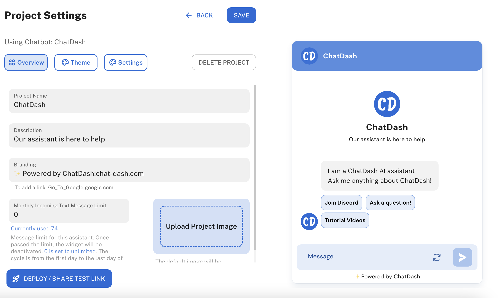

## Overview
Webchat is a conversational interface that allows users to interact with your chatbot. 
You can customize the webchat project settings in ChatDash to match your brand's look and feel.

    

## Customizing a Webchat Project Setting

<iframe
width="560"
height="315"
src="https://www.youtube.com/embed/XZ9sax1ZNdw"
title="YouTube video player"
frameborder="0"
allow="accelerometer; autoplay; clipboard-write; encrypted-media; gyroscope; picture-in-picture"
allowfullscreen
>
</iframe>

1. Login as an agency user in ChatDash.
2. Go to the Clients tab in the ChatDash dashboard.
3. Find the client's project you want to customize.
4. Click on the Settings icon.
    
5. You will be redirected to the Webchat Project Settings page.
6. Customize the following settings:
    - **Project Name**: Change the project name.
    - **Project Description**: Add a description to the project.
    - **Branding**: Customize the webchat branding at the bottom of the webchat. (Default: Powered by ChatDash)
    - **Logo**: Upload a logo for the webchat.
    - **Monthly Incoming Text Message Limits**: Set the monthly incoming text message limits for the project.
    - **Theme**: Customize the webchat color theme.
    - **Fonts**: Change the webchat font style.
    - **Background Image**: Change the webchat background image.
    - **Record Conversation**: Enable or disable the conversation recording feature.
    - **Popup Message**: Customize the popup message that appears when the webchat is minimized.
    - **Autolaunch**: Enable or disable the autolaunch feature. (Webchat will automatically launch when the page loads)
7. Click on the `Save` button to save the changes.